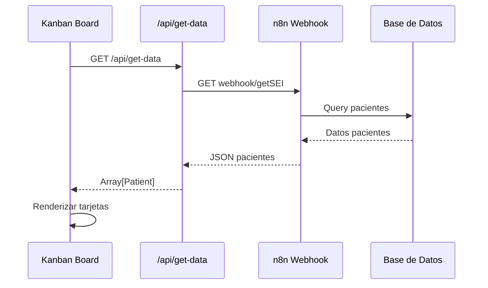
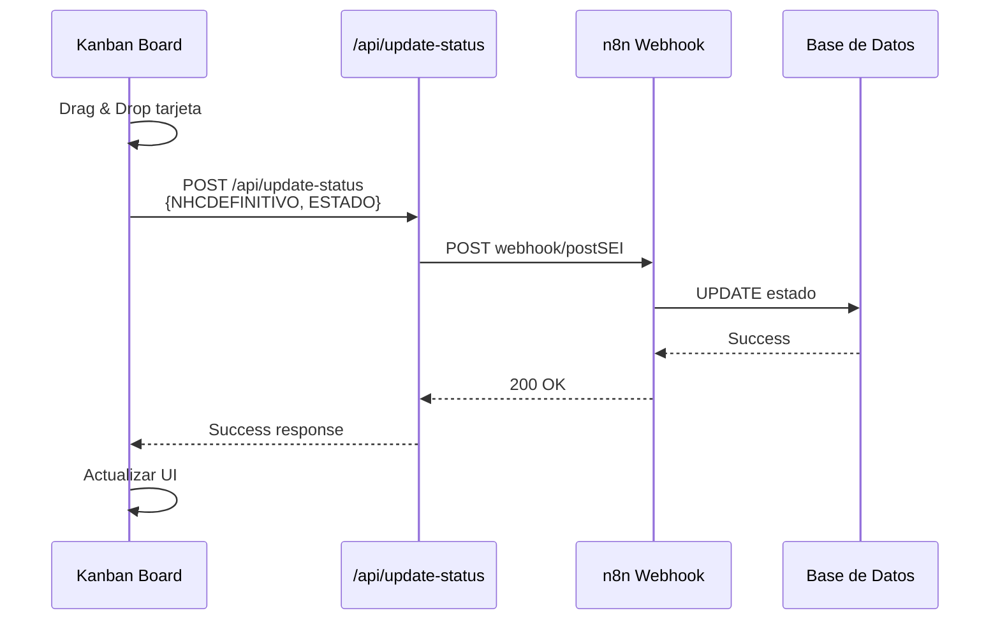
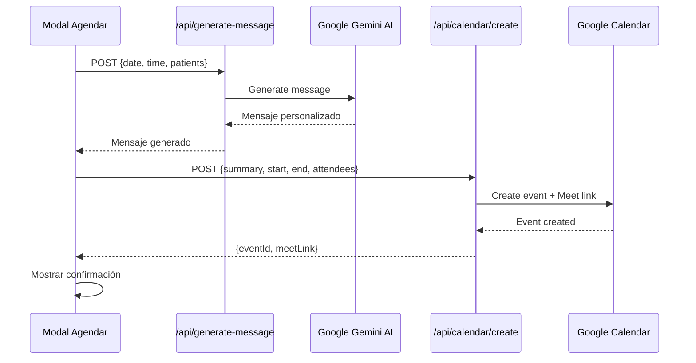

# Arquitectura del Sistema SEI

## Visión General

SEI es una aplicación Next.js de renderizado híbrido (SSR + CSR) que integra múltiples servicios externos para proporcionar un sistema completo de gestión de pacientes prospecto.

## Diagrama de Arquitectura

```mermaid
graph TB
    subgraph "Frontend - Next.js 15"
        UI[Componentes UI<br/>shadcn/ui + Tailwind]
        Pages[Páginas App Router]
        Components[Componentes de Negocio]
    end
    
    subgraph "API Routes"
        Auth[/api/auth]
        GetData[/api/get-data]
        UpdateStatus[/api/update-status]
        Calendar[/api/calendar/create]
        GenMsg[/api/generate-message]
        Sheets[/api/sheets]
    end
    
    subgraph "Servicios Externos"
        N8N[n8n Webhooks]
        GoogleCal[Google Calendar API]
        GoogleSheets[Google Sheets API]
        Gemini[Google Gemini AI]
    end
    
    subgraph "Autenticación"
        NextAuth[NextAuth.js]
        GoogleOAuth[Google OAuth 2.0]
    end
    
    UI --> Pages
    Pages --> Components
    Components --> |Fetch| GetData
    Components --> |Fetch| UpdateStatus
    Components --> |Fetch| Calendar
    Components --> |Fetch| GenMsg
    
    GetData --> N8N
    UpdateStatus --> N8N
    Calendar --> GoogleCal
    GenMsg --> Gemini
    Sheets --> GoogleSheets
    
    Pages --> Auth
    Auth --> NextAuth
    NextAuth --> GoogleOAuth
```

## Estructura de Carpetas

### `/src/app` - App Router de Next.js

```
app/
├── (protected)/          # Rutas protegidas con autenticación
│   ├── layout.tsx       # Layout con sidebar y header
│   ├── admin/           # Panel de administración
│   ├── agenda-naranja/  # Agenda naranja
│   ├── dashboard/       # Dashboard principal
│   └── kanban/          # Tablero Kanban
├── api/                 # API Routes
│   ├── auth/            # NextAuth endpoints
│   ├── calendar/        # Google Calendar
│   ├── generate-message/# IA para mensajes
│   ├── get-data/        # Obtener pacientes
│   ├── sheets/          # Google Sheets
│   └── update-status/   # Actualizar estado
├── auth/                # Páginas de autenticación
├── landing/             # Landing page
├── globals.css          # Estilos globales
└── layout.tsx           # Root layout
```

### `/src/components` - Componentes

```
components/
├── ui/                  # Componentes UI primitivos (shadcn)
│   ├── button.tsx
│   ├── card.tsx
│   ├── dialog.tsx
│   └── ...
├── kanban-board.tsx     # Tablero Kanban principal
├── metrics-dashboard.tsx # Dashboard de métricas
├── schedule-appointment-modal.tsx
├── header.tsx
├── user-nav.tsx
└── ...
```

### `/src/types` - Tipos TypeScript

Contiene tipos compartidos en toda la aplicación:

- `Patient`: Información de pacientes
- `KanbanState`: Estados del tablero Kanban
- `Appointment`: Datos de citas
- `ApiResponse`: Respuestas genéricas de API
- Y más...

### `/src/lib` - Librerías y Utilidades

- `constants.ts`: Constantes globales (URLs, mensajes)
- `utils.ts`: Funciones utilitarias
- `firebase.ts`: Configuración de Firebase

## Flujo de Datos

### 1. Obtención de Datos de Pacientes



### 2. Actualización de Estado



### 3. Creación de Cita en Calendario



## Patrones de Diseño

### 1. Server Components por Defecto

Next.js 15 usa Server Components por defecto, lo que mejora el performance:

```typescript
// Server Component (default)
export default async function DashboardPage() {
  // Puede hacer fetch directamente
  const data = await fetch('...')
  return <Dashboard data={data} />
}
```

### 2. Client Components para Interactividad

Componentes que requieren hooks o eventos del navegador:

```typescript
'use client'; // Marca como Client Component

export function KanbanBoard() {
  const [patients, setPatients] = useState([]);
  // ...
}
```

### 3. API Routes como Proxy

Las API Routes actúan como capa intermedia entre el frontend y servicios externos:

```typescript
// /api/get-data/route.ts
export async function GET() {
  // Oculta credenciales del frontend
  const response = await fetch(N8N_WEBHOOKS.GET_SEI);
  return NextResponse.json(data);
}
```

### 4. Tipos Centralizados

Todos los tipos compartidos están en `/src/types/index.ts`:

```typescript
import type { Patient, KanbanState } from '@/types';
```

### 5. Constantes Centralizadas

URLs y configuración en `/src/lib/constants.ts`:

```typescript
import { N8N_WEBHOOKS, ERROR_MESSAGES } from '@/lib/constants';
```

## Autenticación y Autorización

### NextAuth.js con Google OAuth

```typescript
// /api/auth/[...nextauth]/route.ts
export const authOptions = {
  providers: [
    GoogleProvider({
      clientId: process.env.GOOGLE_CLIENT_ID!,
      clientSecret: process.env.GOOGLE_CLIENT_SECRET!,
      authorization: {
        params: {
          scope: 'openid email profile https://www.googleapis.com/auth/calendar',
        },
      },
    }),
  ],
  // ...
}
```

### Middleware de Protección

```typescript
// middleware.ts
export function middleware(request: NextRequest) {
  if (request.nextUrl.pathname === '/') {
    return NextResponse.redirect(new URL('/landing', request.url))
  }
}
```

## Optimizaciones de Performance

1. **Turbopack**: Bundler rápido para desarrollo
2. **Server Components**: Reduce JavaScript en el cliente
3. **Cache deshabilitado**: Para datos en tiempo real
4. **React Query** (futuro): Para cacheo inteligente en cliente
5. **Lazy Loading**: Componentes cargados bajo demanda

## Seguridad

1. **Credenciales en servidor**: API keys nunca expuestas al cliente
2. **CORS**: Configurado solo para dominios permitidos
3. **Validación de entrada**: En todas las API routes
4. **OAuth 2.0**: Autenticación segura con Google
5. **HTTPS**: Requerido en producción

## Integración con n8n

n8n actúa como orquestador de workflows:

- **getSEI**: Obtiene datos de pacientes desde la base de datos
- **postSEI**: Actualiza el estado de pacientes
- **createCalendarEventSEI**: Webhook para eventos de calendario

## Próximas Mejoras Arquitectónicas

1. Implementar **React Query** para mejor gestión de cache
2. Agregar **Redis** para sessions y cache
3. Implementar **Webhooks reversos** para actualizaciones en tiempo real
4. Migrar a **tRPC** para type-safety end-to-end
5. Agregar **Tests** con Jest y Testing Library
6. Implementar **Monitoring** con Sentry o similar

---

Para más detalles sobre componentes específicos, ver [COMPONENTES.md](./COMPONENTES.md)  
Para documentación de API, ver [API.md](./API.md)
